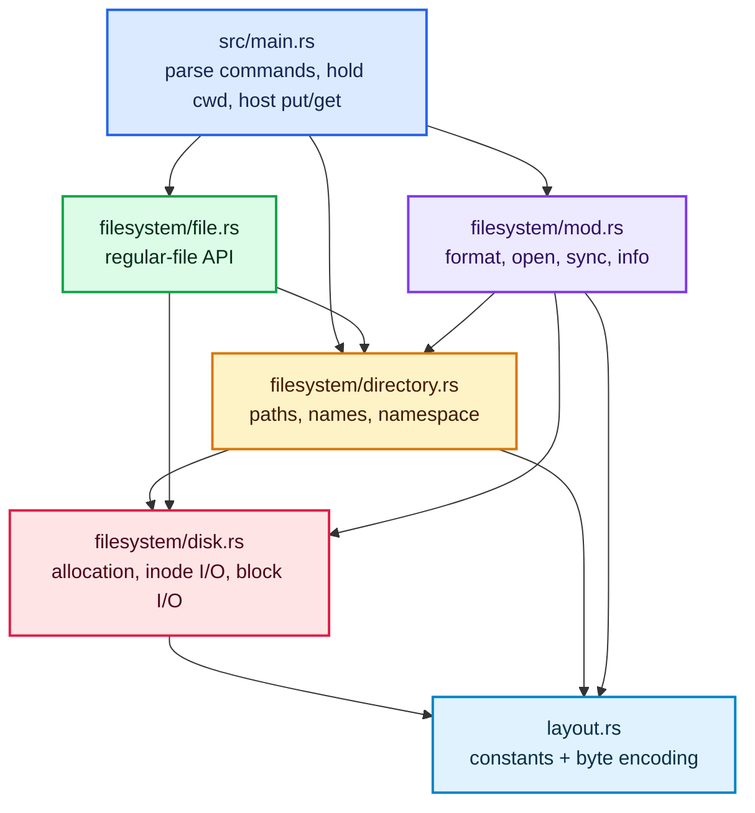

# How Rustyfile operations execute

This is the reading map for the operation tutorials. The tutorials follow each
command from the CLI adapter into the filesystem library, through inode and
directory logic, and finally to the exact host-file reads and writes. Every
important step includes a source link and an inline excerpt of the code it is
describing.

The central rule is:

> A path finds a name in directory data, the name identifies an inode, and the
> inode identifies data blocks.

```mermaid
flowchart LR
    CLI["CLI command<br/><code>src/main.rs</code>"]:::cli
    API["Public FileSystem method<br/><code>src/filesystem/*.rs</code>"]:::api
    PATH["Path + directory layer<br/>names → inode numbers"]:::directory
    INODE["Inode layer<br/>kind, size, direct pointers"]:::inode
    BLOCK["Block layer<br/>4096-byte reads/writes"]:::block
    IMAGE[("disk.img<br/>ordinary host file")]:::image

    CLI --> API
    API --> PATH
    PATH --> INODE
    INODE --> BLOCK
    BLOCK --> IMAGE

    classDef cli fill:#dbeafe,stroke:#2563eb,color:#172554,stroke-width:2px
    classDef api fill:#ede9fe,stroke:#7c3aed,color:#2e1065,stroke-width:2px
    classDef directory fill:#fef3c7,stroke:#d97706,color:#451a03,stroke-width:2px
    classDef inode fill:#dcfce7,stroke:#16a34a,color:#052e16,stroke-width:2px
    classDef block fill:#ffe4e6,stroke:#e11d48,color:#4c0519,stroke-width:2px
    classDef image fill:#e0f2fe,stroke:#0284c7,color:#082f49,stroke-width:3px
```

## Tutorials

1. [Image lifecycle: format, open, sync, and info](tutorials/01-image-lifecycle.md)
2. [Paths and directories: `cd`, `ls`, `mkdir`, `rmdir`, and `stat`](tutorials/02-paths-and-directories.md)
3. [File contents: `touch`, `cat`, `write`, `append`, `put`, and `get`](tutorials/03-file-contents.md)
4. [Deletion, allocation, and failure safety](tutorials/04-deletion-and-allocation.md)

Read [the byte-level format reference](FORMAT.md) alongside these tutorials when
you want the precise offsets of a superblock field, inode, or directory entry.

## Complete operation index

The “deepest helper” column names the point at which an operation reaches the
image. A command such as `pwd` is intentionally absent from the filesystem
column because it only prints CLI state and performs no image I/O.

| User operation | CLI dispatch | Public filesystem entry | Deepest relevant helper | Tutorial |
| --- | --- | --- | --- | --- |
| `mkfs` | [`command_mkfs`](../src/main.rs#L48-L75) | [`FileSystem::format`](../src/filesystem/mod.rs#L64-L121) | `write_block`, `write_inode`, `write_directory` | [1](tutorials/01-image-lifecycle.md#format-an-image-mkfs) |
| open image / shell | [`run`, `command_shell`](../src/main.rs#L17-L120) | [`FileSystem::open`](../src/filesystem/mod.rs#L124-L142) | `read_block`, `Superblock::decode` | [1](tutorials/01-image-lifecycle.md#open-an-existing-image) |
| `sync` / command exit | [`run`, `command_shell`](../src/main.rs#L17-L120) | [`FileSystem::sync`](../src/filesystem/mod.rs#L145-L148) | host `File::sync_all` | [1](tutorials/01-image-lifecycle.md#flush-writes-sync) |
| `info` | [`execute`](../src/main.rs#L122-L252) | [`FileSystem::info`](../src/filesystem/mod.rs#L151-L160) | `read_block` on both bitmaps | [1](tutorials/01-image-lifecycle.md#inspect-allocation-info) |
| `pwd` | [`execute`](../src/main.rs#L132-L135) | none | none; prints `cwd_path` | [2](tutorials/02-paths-and-directories.md#pwd-and-cd-cli-state-versus-disk-state) |
| `cd` | [`execute`](../src/main.rs#L136-L146) | `resolve_path`, `stat` | `read_directory`, `read_inode_data` | [2](tutorials/02-paths-and-directories.md#pwd-and-cd-cli-state-versus-disk-state) |
| resolve a path | CLI commands pass `cwd` + path | [`resolve_path`](../src/filesystem/directory.rs#L8-L35) | `read_inode`, `read_directory` | [2](tutorials/02-paths-and-directories.md#the-shared-first-step-resolve-a-path) |
| `ls` / `dir` | [`execute`](../src/main.rs#L147-L158) | [`list_dir`](../src/filesystem/directory.rs#L38-L61) | `read_directory`, then child `read_inode` | [2](tutorials/02-paths-and-directories.md#read-a-directory-ls-or-dir) |
| `mkdir` | [`execute`](../src/main.rs#L159-L162) | [`create_dir`](../src/filesystem/directory.rs#L76-L78) | `create`, `write_directory` | [2](tutorials/02-paths-and-directories.md#create-a-directory-mkdir) |
| `rmdir` | [`execute`](../src/main.rs#L199-L209) | [`remove_dir`](../src/filesystem/directory.rs#L81-L105) | `write_directory`, bitmap clearing | [2](tutorials/02-paths-and-directories.md#remove-an-empty-directory-rmdir) |
| `stat` | [`execute`](../src/main.rs#L210-L218) | [`stat`](../src/filesystem/directory.rs#L64-L73) | `resolve_path`, `read_inode` | [2](tutorials/02-paths-and-directories.md#inspect-one-inode-stat) |
| `touch` | [`execute`](../src/main.rs#L163-L176) | [`create_file`](../src/filesystem/file.rs#L8-L10) | shared `create` | [3](tutorials/03-file-contents.md#create-an-empty-file-touch) |
| `cat` | [`execute`](../src/main.rs#L191-L198) | [`read_file`](../src/filesystem/file.rs#L13-L20) | `read_inode_data`, `read_block` | [3](tutorials/03-file-contents.md#read-file-bytes-cat) |
| `write` | [`execute`](../src/main.rs#L177-L183) | [`write_file`](../src/filesystem/file.rs#L23-L35) | `replace_inode_data`, `write_block` | [3](tutorials/03-file-contents.md#create-or-replace-file-bytes-write) |
| `append` | [`execute`](../src/main.rs#L184-L190) | [`append_file`](../src/filesystem/file.rs#L38-L46) | read whole file, then `write_file` | [3](tutorials/03-file-contents.md#append-file-bytes-append) |
| `put` | [`execute`](../src/main.rs#L228-L237) | `write_file` | host read, then normal write path | [3](tutorials/03-file-contents.md#import-and-export-put-and-get) |
| `get` | [`execute`](../src/main.rs#L238-L247) | `read_file` | normal read path, then host write | [3](tutorials/03-file-contents.md#import-and-export-put-and-get) |
| `rm` | [`execute`](../src/main.rs#L195-L198) | [`remove_file`](../src/filesystem/file.rs#L49-L69) | parent rewrite, block/inode bit clearing | [4](tutorials/04-deletion-and-allocation.md#delete-a-regular-file-rm) |

## Source layers and their jobs

The layer boundary matters while reading the snippets:

- `main.rs` translates text commands and accesses host files.
- `directory.rs` owns names and parent/child links.
- `file.rs` chooses the high-level regular-file behavior.
- `disk.rs` is where inode slots, bitmap bits, and 4096-byte blocks change.
- `layout.rs` defines what those bytes mean.

