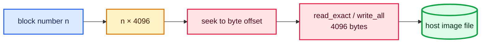
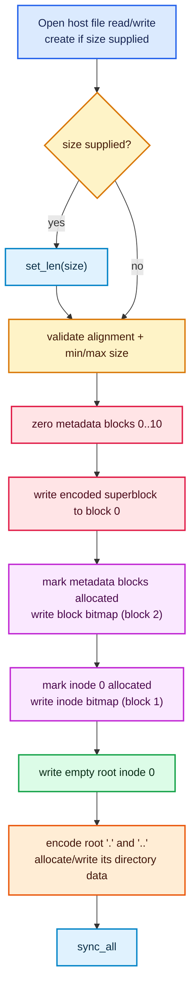
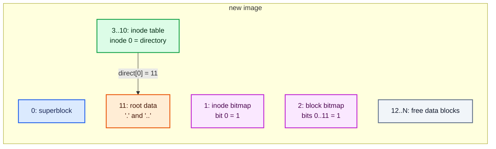
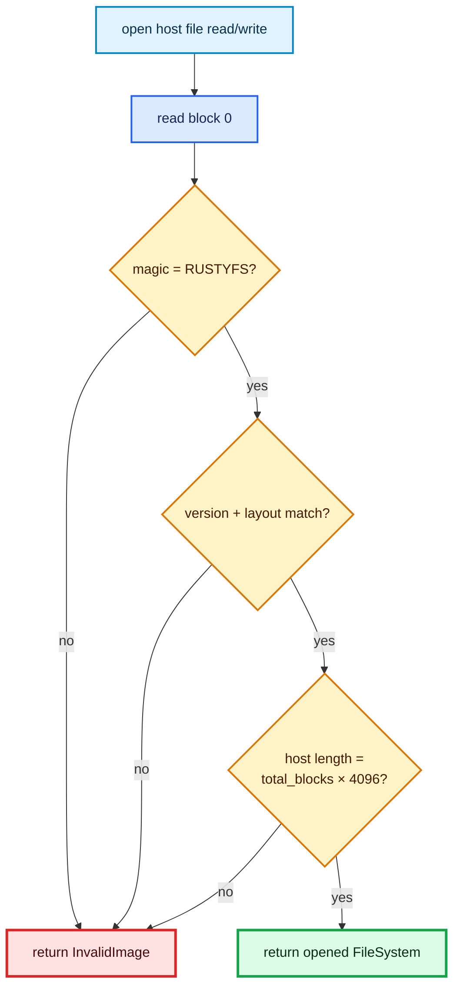
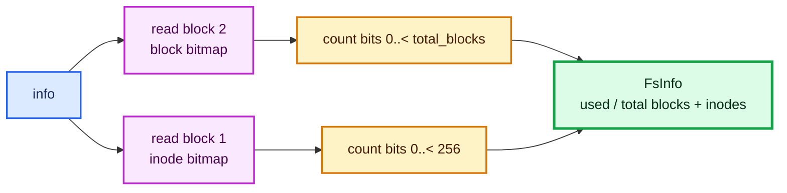

# Tutorial 1: image lifecycle

This tutorial follows formatting, opening, flushing, and allocation inspection.
These operations establish the “disk” that every later tutorial uses.

## Mental model: the host file is the block device

Rustyfile does not ask the kernel to mount anything. `FileSystem` stores an open
`std::fs::File` and a decoded superblock:

Source: [`src/filesystem/mod.rs` — `FileSystem`](../../src/filesystem/mod.rs#L53-L60)

```rust
pub struct FileSystem {
    pub(super) file: File,
    pub(super) superblock: Superblock,
}
```

All block I/O calculates a byte offset inside that host file:

Source: [`src/filesystem/disk.rs` — `read_block` and `write_block`](../../src/filesystem/disk.rs#L196-L217)

```rust
self.file
    .seek(SeekFrom::Start(block as u64 * BLOCK_SIZE as u64))?;
self.file.read_exact(&mut bytes)?;
```

Writing uses the same offset formula and `write_all`. Because `BLOCK_SIZE` is
4096, block 11 begins at host-file byte `11 × 4096 = 45056`.



## Format an image (`mkfs`)

Try:

```console
cargo run -- mkfs disk.img --size 100M
```

The CLI parses `--size`, then calls `FileSystem::format`:

Source: [`src/main.rs` — `command_mkfs`](../../src/main.rs#L48-L75)

```rust
let size = match &args[1..] {
    [] => None,
    [flag, value] if flag == "--size" => Some(parse_size(value)?),
    _ => {
        return Err(FsError::InvalidPath(
            "usage: rustyfile mkfs <image> [--size 100M]".into(),
        ))
    }
};
let info = FileSystem::format(image, size)?.info()?;
```

### Exact execution



The core formatting code makes each state transition visible:

Source: [`src/filesystem/mod.rs` — `FileSystem::format`](../../src/filesystem/mod.rs#L64-L121)

```rust
// Reset metadata; unreachable old data blocks need not be erased.
for block in 0..DATA_BLOCK_START {
    fs.write_block(block, &[0; BLOCK_SIZE])?;
}
fs.write_block(0, &fs.superblock.encode())?;

// Metadata blocks always own their corresponding block bits.
let mut block_bitmap = [0; BLOCK_SIZE];
for block in 0..DATA_BLOCK_START {
    set_bit(&mut block_bitmap, block, true);
}
fs.write_block(BLOCK_BITMAP_BLOCK, &block_bitmap)?;

// Inode zero is permanently the root directory.
let mut inode_bitmap = [0; BLOCK_SIZE];
set_bit(&mut inode_bitmap, ROOT_INODE, true);
fs.write_block(INODE_BITMAP_BLOCK, &inode_bitmap)?;
```

It then creates root’s structural entries:

Source: [`src/filesystem/mod.rs` — root initialization](../../src/filesystem/mod.rs#L103-L119)

```rust
let mut root = Inode::empty(FileKind::Directory);
fs.write_inode(ROOT_INODE, &root)?;
let entries = vec![
    DirEntry {
        inode: ROOT_INODE,
        kind: FileKind::Directory,
        name: ".".into(),
    },
    DirEntry {
        inode: ROOT_INODE,
        kind: FileKind::Directory,
        name: "..".into(),
    },
];
fs.write_directory(ROOT_INODE, &mut root, &entries)?;
fs.file.sync_all()?;
```

`write_directory` encodes two 64-byte entries (128 bytes total), asks the disk
layer for one data block, writes it, and updates root inode 0. Thus a newly
formatted image has 12 allocated blocks: metadata blocks 0–10 and one root-data
block.



Formatting resets metadata, not every data block. Old data bytes may remain in
now-unallocated blocks, but block allocation clears a block before reuse. See
[Tutorial 4](04-deletion-and-allocation.md#allocate-a-data-block).

## Open an existing image

One-shot commands and the interactive shell both start with
`FileSystem::open`. Opening does not scan directories or bitmaps.

Source: [`src/filesystem/mod.rs` — `FileSystem::open`](../../src/filesystem/mod.rs#L123-L142)

```rust
let file = OpenOptions::new().read(true).write(true).open(path)?;
let image_size = file.metadata()?.len();
let mut fs = Self {
    file,
    // Block zero must be read before the real count is known.
    superblock: Superblock { total_blocks: 0 },
};

let bytes = fs.read_block(0)?;
let superblock = Superblock::decode(&bytes)?;
if image_size != superblock.total_blocks as u64 * BLOCK_SIZE as u64 {
    return Err(FsError::InvalidImage(
        "image length differs from its superblock".into(),
    ));
}
fs.superblock = superblock;
```

The temporary block count of zero is deliberate: `read_block(0)` permits the
bootstrap read before the true count is known. `Superblock::decode` then checks
the magic, version, compiled layout constants, and valid block-count range:

Source: [`src/layout.rs` — `Superblock::decode`](../../src/layout.rs#L89-L126)

```rust
if bytes[0..8] != MAGIC {
    return Err(FsError::InvalidImage(
        "missing RUSTYFS signature; run `rustyfile mkfs` first".into(),
    ));
}
let version = get_u32(bytes, 8);
if version != VERSION {
    return Err(FsError::InvalidImage(format!(
        "unsupported format version {version}"
    )));
}
```



## Flush writes (`sync`)

Rustyfile performs direct `seek` + `write_all` calls during operations. `sync`
asks the host OS to flush pending file writes:

Source: [`src/filesystem/mod.rs` — `FileSystem::sync`](../../src/filesystem/mod.rs#L144-L148)

```rust
pub fn sync(&mut self) -> Result<()> {
    self.file.sync_all()?;
    Ok(())
}
```

The CLI calls this after a one-shot command and when a shell exits normally.
There is no journal or transaction log, so `sync` is persistence plumbing, not
multi-write crash atomicity.

## Inspect allocation (`info`)

Try:

```console
cargo run -- disk.img info
```

The API reads the block bitmap and inode bitmap, then counts set bits only over
the valid ranges:

Source: [`src/filesystem/mod.rs` — `FileSystem::info`](../../src/filesystem/mod.rs#L150-L160)

```rust
let block_bitmap = self.read_block(BLOCK_BITMAP_BLOCK)?;
let inode_bitmap = self.read_block(INODE_BITMAP_BLOCK)?;
Ok(FsInfo {
    total_blocks: self.superblock.total_blocks,
    used_blocks: count_set_bits(&block_bitmap, self.superblock.total_blocks),
    total_inodes: INODE_COUNT,
    used_inodes: count_set_bits(&inode_bitmap, INODE_COUNT),
})
```

Source: [`src/filesystem/disk.rs` — `count_set_bits`](../../src/filesystem/disk.rs#L262-L265)

```rust
pub(super) fn count_set_bits(bitmap: &[u8], up_to: u32) -> u32 {
    (0..up_to).filter(|bit| get_bit(bitmap, *bit)).count() as u32
}
```



`info` trusts the bitmaps; it does not walk every inode to reconstruct usage.

## Check your understanding

After formatting, predict the results before running `info`:

- used inodes: 1, because inode 0 is root;
- used blocks: 12, because blocks 0–10 are metadata and block 11 stores root’s
  `.` and `..` entries;
- creating an empty regular file adds one inode but no file data block; however,
  growing the parent directory can add a directory data block at a boundary.

Continue with [Tutorial 2: paths and directories](02-paths-and-directories.md).
