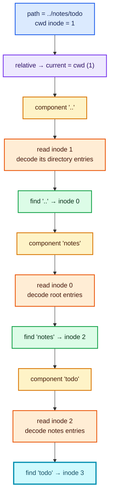
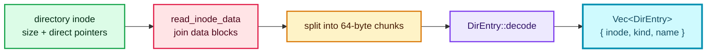
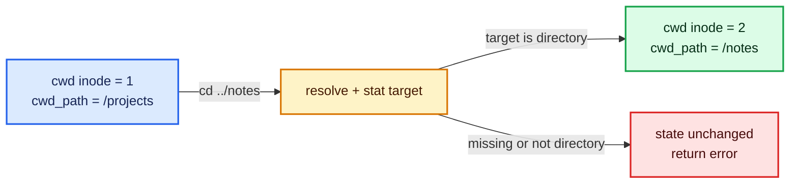
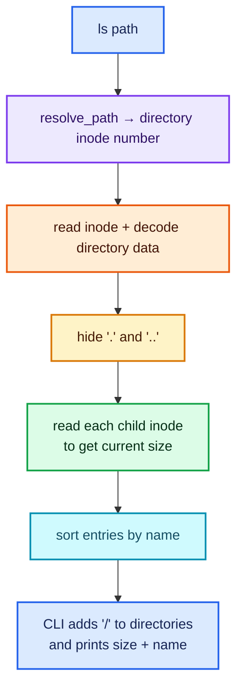
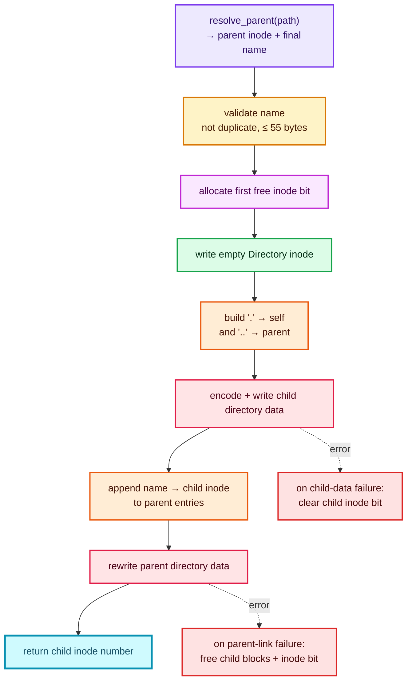
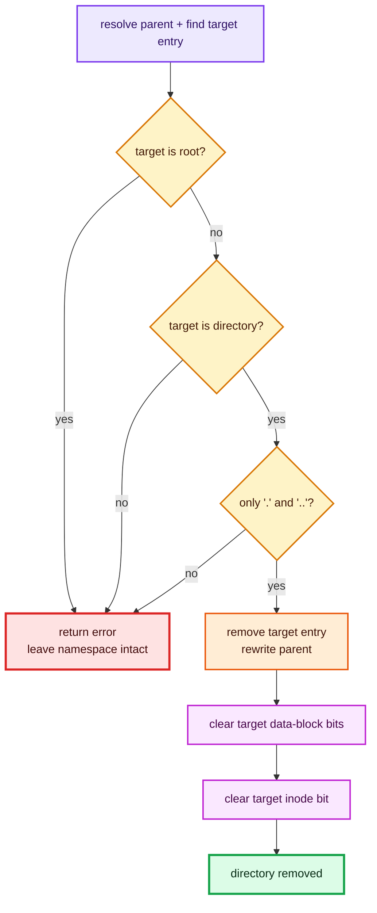

# Tutorial 2: paths and directories

This tutorial follows pathname traversal, `pwd`, `cd`, `ls`, `mkdir`, `rmdir`,
and `stat`. Directory data is not a special Rust map: it is ordinary inode data
containing fixed-size name-to-inode records.

## The shared first step: resolve a path

Suppose the shell’s current inode is 1 (`/projects`) and it resolves
`../notes/todo`. Relative paths start at `cwd`; absolute paths start at root
inode 0.

Source: [`src/filesystem/directory.rs` — `resolve_path`](../../src/filesystem/directory.rs#L8-L35)

```rust
let mut current = if path.starts_with('/') {
    ROOT_INODE
} else {
    cwd
};

// Each name is looked up in the directory reached so far.
for component in path.split('/').filter(|part| !part.is_empty()) {
    if component == "." {
        continue;
    }
    let inode = self.read_inode(current)?;
    if inode.kind != FileKind::Directory {
        return Err(FsError::NotDirectory(component.into()));
    }
    let entry = self
        .read_directory(&inode)?
        .into_iter()
        .find(|entry| entry.name == component)
        .ok_or_else(|| FsError::NotFound(path.into()))?;
    current = entry.inode;
}
```



Three details are worth noticing:

1. Repeated `/` characters disappear because empty components are filtered.
2. `.` is skipped in code, but `..` is looked up like a real name. Every
   directory stores a `..` entry, so no in-memory parent map is needed.
3. Each component costs at least one inode read and one directory-data read.
   This toy filesystem has no cache.

### How directory bytes become entries

`read_directory` first reads the inode’s data blocks, then decodes every
64-byte slot:

Source: [`src/filesystem/directory.rs` — `read_directory`](../../src/filesystem/directory.rs#L175-L196)

```rust
let data = self.read_inode_data(inode)?;
if data.len() % DIR_ENTRY_SIZE != 0 {
    return Err(FsError::Corrupt(
        "directory size is not a whole number of entries".into(),
    ));
}

let mut entries = Vec::new();
for bytes in data.chunks_exact(DIR_ENTRY_SIZE) {
    if let Some(entry) = DirEntry::decode(bytes)? {
        entries.push(entry);
    }
}
```

The decoder turns bytes into an inode number, kind, and UTF-8 name:

Source: [`src/layout.rs` — `DirEntry::decode`](../../src/layout.rs#L200-L218)

```rust
if bytes[5] == 0 {
    return Ok(None);
}
let length = bytes[6] as usize;
let name = std::str::from_utf8(&bytes[8..8 + length])
    .map_err(|_| FsError::Corrupt("directory name is not UTF-8".into()))?
    .to_owned();
Ok(Some(Self {
    inode: get_u32(bytes, 0),
    kind: FileKind::from_byte(bytes[4])?,
    name,
}))
```



## `pwd` and `cd`: CLI state versus disk state

`pwd` does no filesystem I/O. The shell stores both:

- `cwd`: the current directory’s inode number, used by library operations;
- `cwd_path`: a display string, used by the prompt and `pwd`.

Source: [`src/main.rs` — `pwd` and `cd` dispatch](../../src/main.rs#L132-L146)

```rust
"pwd" => {
    require_count(args, 0, "pwd")?;
    println!("{cwd_path}");
}
"cd" => {
    let path = exactly_one(args, "cd <directory>")?;
    let inode_number = fs.resolve_path(*cwd, path)?;
    let stat = fs.stat(*cwd, path)?;
    if stat.kind != FileKind::Directory {
        return Err(FsError::NotDirectory(path.into()));
    }
    *cwd = inode_number;
    *cwd_path = normalize_display_path(cwd_path, path);
}
```

`cd` resolves the target, verifies that its inode is a directory, and only then
updates both pieces of shell state. `normalize_display_path` affects display
only; it never changes on-disk directory entries.



## Read a directory (`ls` or `dir`)

Try:

```console
cargo run -- disk.img ls /
```

The CLI only chooses a default path and formats the results. `list_dir` does the
filesystem work:

Source: [`src/filesystem/directory.rs` — `list_dir`](../../src/filesystem/directory.rs#L38-L61)

```rust
let inode_number = self.resolve_path(cwd, path)?;
let inode = self.read_inode(inode_number)?;
if inode.kind != FileKind::Directory {
    return Err(FsError::NotDirectory(path.into()));
}

// Read each child inode to add its current size to the listing.
let mut result = Vec::new();
for entry in self.read_directory(&inode)? {
    if entry.name == "." || entry.name == ".." {
        continue;
    }
    let child = self.read_inode(entry.inode)?;
    result.push(DirEntryInfo {
        inode: entry.inode,
        kind: entry.kind,
        name: entry.name,
        size: child.size,
    });
}
result.sort_by(|a, b| a.name.cmp(&b.name));
```



The directory entry stores a child kind, but it does not store the child’s
size. That is why `ls` performs an additional inode read per visible entry.

## Create a directory (`mkdir`)

Try:

```console
cargo run -- disk.img mkdir /projects
```

`create_dir` is a small type-specific wrapper:

Source: [`src/filesystem/directory.rs` — `create_dir`](../../src/filesystem/directory.rs#L75-L78)

```rust
pub fn create_dir(&mut self, cwd: u32, path: &str) -> Result<u32> {
    self.create(cwd, path, FileKind::Directory)
}
```

The shared `create` helper is also used by `touch`. First it separates the
parent path from the final name:

Source: [`src/filesystem/directory.rs` — `resolve_parent`](../../src/filesystem/directory.rs#L158-L173)

```rust
let trimmed = path.trim_end_matches('/');
let (parent_path, name) = match trimmed.rsplit_once('/') {
    Some(("", name)) => ("/", name),
    Some((parent, name)) => (parent, name),
    None => (".", trimmed),
};
Ok((self.resolve_path(cwd, parent_path)?, name.to_owned()))
```

For `/projects/rust`, this produces parent path `/projects` and final name
`rust`. The parent must already exist; recursive directory creation is not
implemented.

### Exact creation sequence



Here is the child initialization and parent link—the key part of `create`:

Source: [`src/filesystem/directory.rs` — shared `create`](../../src/filesystem/directory.rs#L108-L156)

```rust
let inode_number = self.allocate_inode()?;
let mut inode = Inode::empty(kind);
self.write_inode(inode_number, &inode)?;

if kind == FileKind::Directory {
    let initial = vec![
        DirEntry {
            inode: inode_number,
            kind,
            name: ".".into(),
        },
        DirEntry {
            inode: parent_number,
            kind: FileKind::Directory,
            name: "..".into(),
        },
    ];
    if let Err(error) = self.write_directory(inode_number, &mut inode, &initial) {
        self.set_inode_allocated(inode_number, false)?;
        return Err(error);
    }
}

// Linking is the commit point; clean up the child if it fails.
entries.push(DirEntry {
    inode: inode_number,
    kind,
    name,
});
```

`allocate_inode` reads block 1, scans bits 1 through 255, sets the first free
bit, and writes the bitmap back. Inode 0 is skipped because it is permanently
root.

The child becomes reachable only when the parent entry is written. The code
therefore treats linking into the parent as the creation commit point and cleans
up an unlinked child if that write fails.

## How a directory rewrite reaches disk

All namespace updates eventually call `write_directory`:

Source: [`src/filesystem/directory.rs` — `write_directory`](../../src/filesystem/directory.rs#L198-L212)

```rust
let mut data = Vec::with_capacity(entries.len() * DIR_ENTRY_SIZE);
for entry in entries {
    data.extend_from_slice(&entry.encode()?);
}

// Reuse blocks so deletion still works on a completely full image.
self.rewrite_inode_data_reusing_blocks(inode_number, inode, &data)
```



```mermaid
flowchart LR
    V["Vec&lt;DirEntry&gt;"]:::directory
    ENC["encode each as 64 bytes"]:::encode
    BYTES["contiguous directory bytes"]:::bytes
    REUSE["retain old blocks where possible"]:::block
    GROW["allocate only extra blocks needed"]:::bitmap
    WRITE["write directory blocks"]:::write
    INODE["update inode pointers + size"]:::inode
    FREE["free surplus old blocks"]:::free

    V --> ENC --> BYTES --> REUSE --> GROW --> WRITE --> INODE --> FREE

    classDef directory fill:#ffedd5,stroke:#ea580c,color:#431407,stroke-width:2px
    classDef encode fill:#ede9fe,stroke:#7c3aed,color:#2e1065,stroke-width:2px
    classDef bytes fill:#fef3c7,stroke:#d97706,color:#451a03,stroke-width:2px
    classDef block fill:#dbeafe,stroke:#2563eb,color:#172554,stroke-width:2px
    classDef bitmap fill:#fae8ff,stroke:#c026d3,color:#4a044e,stroke-width:2px
    classDef write fill:#ffe4e6,stroke:#e11d48,color:#4c0519,stroke-width:2px
    classDef inode fill:#dcfce7,stroke:#16a34a,color:#052e16,stroke-width:2px
    classDef free fill:#cffafe,stroke:#0891b2,color:#164e63,stroke-width:2px
```

Reusing blocks is important: removing one entry must work even when there are
no free blocks. Regular-file replacement uses a different copy-on-replace
strategy, explained in [Tutorial 3](03-file-contents.md#create-or-replace-file-bytes-write).

## Remove an empty directory (`rmdir`)

The CLI first prevents removal of the current working directory:

Source: [`src/main.rs` — `rmdir` dispatch](../../src/main.rs#L199-L209)

```rust
let target = fs.resolve_path(*cwd, path)?;
if target == *cwd {
    return Err(FsError::InvalidPath(
        "cannot remove the current directory".into(),
    ));
}
fs.remove_dir(*cwd, path)?;
```

The library then proves that the target is a non-root, empty directory. Empty
means its decoded entries contain no names other than `.` and `..`.

Source: [`src/filesystem/directory.rs` — `remove_dir`](../../src/filesystem/directory.rs#L81-L105)

```rust
if target_number == ROOT_INODE {
    return Err(FsError::InvalidPath("cannot remove root".into()));
}
let target = self.read_inode(target_number)?;
if target.kind != FileKind::Directory {
    return Err(FsError::NotDirectory(path.into()));
}
if has_user_entries(&self.read_directory(&target)?) {
    return Err(FsError::DirectoryNotEmpty(path.into()));
}

// Unlink first, then release the unreachable inode and blocks.
entries.remove(index);
self.write_directory(parent_number, &mut parent, &entries)?;
self.free_inode_contents(&target)?;
self.set_inode_allocated(target_number, false)?;
```



The unlink happens before storage is returned to the free pools. Once the
parent no longer contains the name, the target inode and its directory-data
blocks are unreachable and may be reused.

## Inspect one inode (`stat`)

Try:

```console
cargo run -- disk.img stat /projects
```

`stat` resolves the name, reads the resulting inode, and projects its fields
into the public `InodeInfo` type:

Source: [`src/filesystem/directory.rs` — `stat`](../../src/filesystem/directory.rs#L63-L73)

```rust
let inode_number = self.resolve_path(cwd, path)?;
let inode = self.read_inode(inode_number)?;
Ok(InodeInfo {
    inode: inode_number,
    kind: inode.kind,
    size: inode.size,
    blocks: inode.blocks_used(),
})
```

For a directory, `size` is the encoded directory byte length, including hidden
`.` and `..` entries. For any inode, `blocks` is the count of nonzero direct
pointers—not a fresh bitmap calculation.


Continue with [Tutorial 3: file contents](03-file-contents.md).
