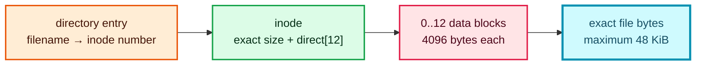
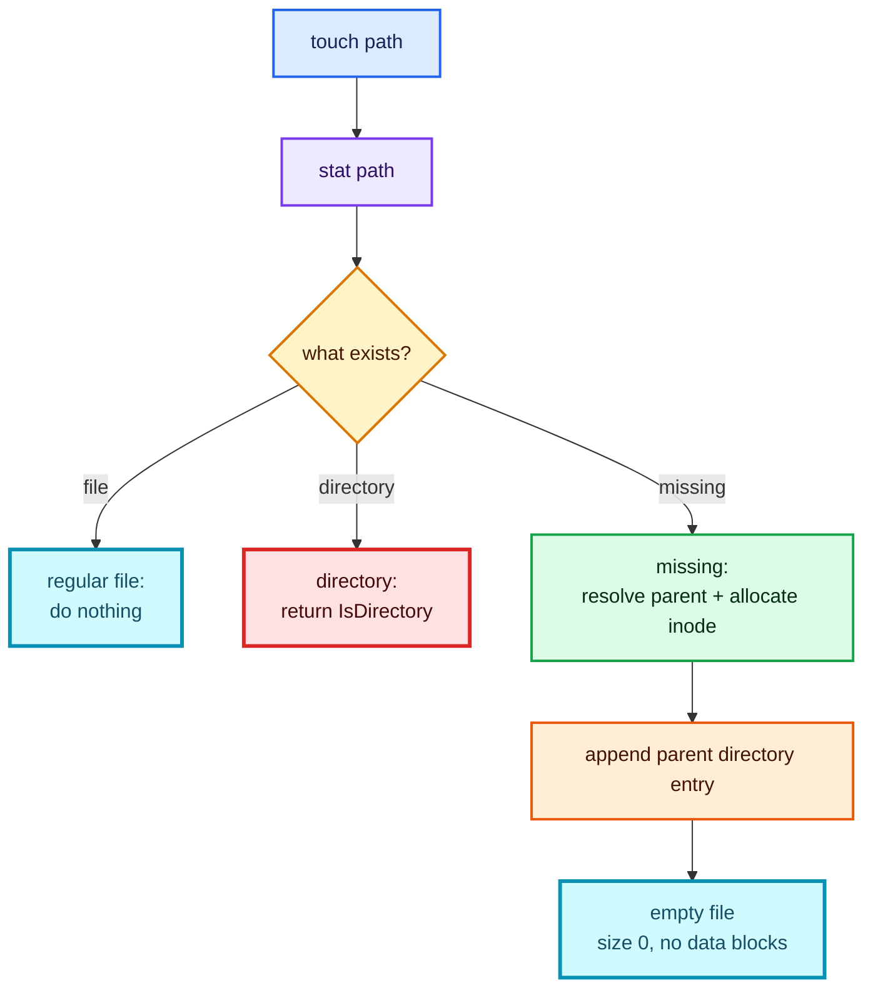
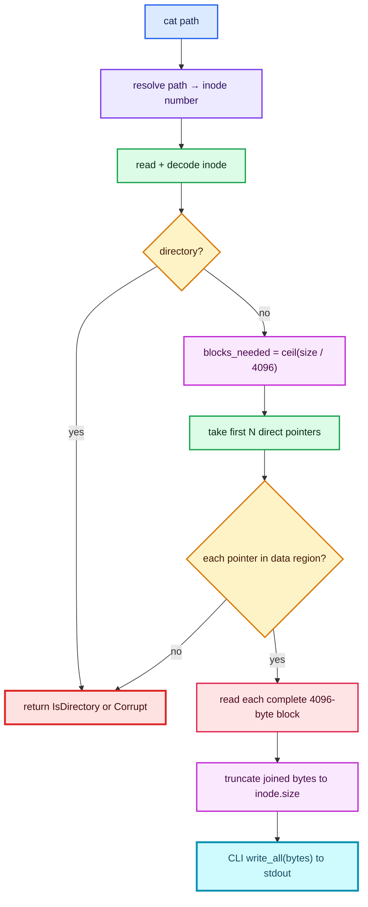
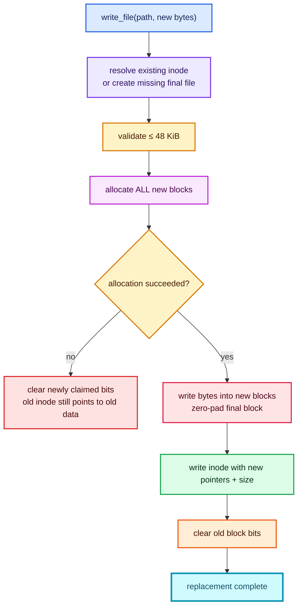
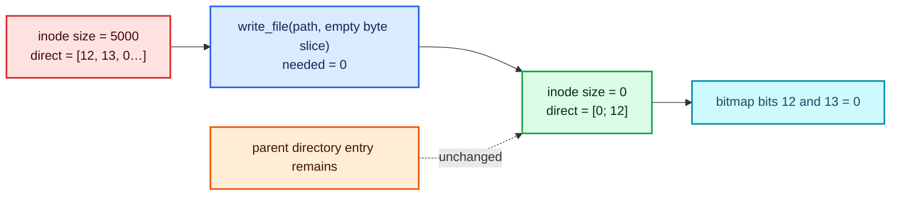

# Tutorial 3: regular-file contents

This tutorial follows `touch`, `cat`, `write`, `append`, `put`, and `get`. It
also shows how to clear a file’s contents without removing its name.

Regular-file bytes travel through this chain:



The filename does not live in the inode. The inode does not contain the file
bytes. It contains an exact byte length and up to twelve block numbers.

## Create an empty file (`touch`)

Try:

```console
cargo run -- disk.img touch /notes.txt
```

The CLI gives `touch` its familiar no-truncation behavior:

Source: [`src/main.rs` — `touch` dispatch](../../src/main.rs#L163-L176)

```rust
match fs.stat(*cwd, path) {
    Ok(stat) if stat.kind == FileKind::File => {}
    Ok(_) => return Err(FsError::IsDirectory(path.into())),
    Err(FsError::NotFound(_)) => {
        fs.create_file(*cwd, path)?;
    }
    Err(error) => return Err(error),
}
```

Therefore:

- an existing regular file is left completely unchanged;
- an existing directory produces `IsDirectory`;
- a missing path calls `create_file`.

The library wrapper selects `FileKind::File` and uses the same namespace helper
as `mkdir`:

Source: [`src/filesystem/file.rs` — `create_file`](../../src/filesystem/file.rs#L7-L10)

```rust
pub fn create_file(&mut self, cwd: u32, path: &str) -> Result<u32> {
    self.create(cwd, path, FileKind::File)
}
```



An empty file needs an inode and a parent directory entry, but no file data
block. Its inode has `size = 0` and twelve zero direct pointers.

## Read file bytes (`cat`)

Try:

```console
cargo run -- disk.img cat /notes.txt
```

`read_file` resolves the path, reads the inode, rejects directories, and passes
the inode to the data layer:

Source: [`src/filesystem/file.rs` — `read_file`](../../src/filesystem/file.rs#L12-L20)

```rust
let inode_number = self.resolve_path(cwd, path)?;
let inode = self.read_inode(inode_number)?;
if inode.kind == FileKind::Directory {
    return Err(FsError::IsDirectory(path.into()));
}
self.read_inode_data(&inode)
```

The data layer calculates how many pointers the exact size needs, validates
each pointer, reads complete blocks, and truncates padding:

Source: [`src/filesystem/disk.rs` — `read_inode_data`](../../src/filesystem/disk.rs#L11-L27)

```rust
let mut result = Vec::with_capacity(inode.size as usize);
let blocks_needed = blocks_for(inode.size as usize);

for block in inode.direct.iter().take(blocks_needed) {
    if *block < DATA_BLOCK_START || *block >= self.superblock.total_blocks {
        return Err(FsError::Corrupt(format!(
            "inode refers to invalid data block {block}"
        )));
    }
    result.extend_from_slice(&self.read_block(*block)?);
}
result.truncate(inode.size as usize);
```

For a 5000-byte file, `blocks_for(5000)` is 2. Both 4096-byte blocks are read,
producing 8192 bytes in memory, then the result is truncated back to exactly
5000 bytes.



`cat` is only the text-oriented presentation. The API returns `Vec<u8>` and
does not require UTF-8:

Source: [`src/main.rs` — `cat` output](../../src/main.rs#L191-L198)

```rust
let bytes = fs.read_file(*cwd, path)?;
io::stdout().write_all(&bytes)?;
if !bytes.ends_with(b"\n") {
    println!();
}
```

## Create or replace file bytes (`write`)

Try:

```console
cargo run -- disk.img write /notes.txt "hello blocks"
```

The CLI joins all text arguments after the path with spaces, converts that
string to bytes, and calls `write_file`:

Source: [`src/main.rs` — `write` dispatch](../../src/main.rs#L177-L183)

```rust
if args.len() < 2 {
    return Err(FsError::InvalidPath("usage: write <file> <text>".into()));
}
fs.write_file(*cwd, &args[0], args[1..].join(" ").as_bytes())?;
```

### Step 1: find or create the inode

Source: [`src/filesystem/file.rs` — `write_file`](../../src/filesystem/file.rs#L22-L35)

```rust
let inode_number = match self.resolve_path(cwd, path) {
    Ok(number) => number,
    Err(FsError::NotFound(_)) => self.create_file(cwd, path)?,
    Err(error) => return Err(error),
};
let mut inode = self.read_inode(inode_number)?;
if inode.kind == FileKind::Directory {
    return Err(FsError::IsDirectory(path.into()));
}
self.replace_inode_data(inode_number, &mut inode, data)
```

If only the final name is missing, `create_file` links a new empty inode into
the parent. If a parent component is missing, that create attempt fails while
resolving the parent; `write` does not create intermediate directories.

### Step 2: allocate a complete replacement

`replace_inode_data` enforces the 48 KiB maximum and calculates
`ceil(data.len() / 4096)`:

Source: [`src/filesystem/disk.rs` — allocation phase](../../src/filesystem/disk.rs#L29-L52)

```rust
ensure_file_size(data.len())?;
let needed = blocks_for(data.len());

// Claim every new block before changing the inode.
let mut new_blocks = Vec::with_capacity(needed);
for _ in 0..needed {
    match self.allocate_block() {
        Ok(block) => new_blocks.push(block),
        Err(error) => {
            // Roll back claims; the old inode is still untouched.
            for block in new_blocks {
                self.set_block_allocated(block, false)?;
            }
            return Err(error);
        }
    }
}
```

The old inode and old blocks remain untouched while every replacement block is
claimed. If allocation runs out of space, newly claimed bits are cleared and
the old file remains readable.

### Step 3: fill the new blocks

Source: [`src/filesystem/disk.rs` — data-block writes](../../src/filesystem/disk.rs#L54-L61)

```rust
for (index, block) in new_blocks.iter().enumerate() {
    let mut bytes = [0; BLOCK_SIZE];
    let start = index * BLOCK_SIZE;
    let end = data.len().min(start + BLOCK_SIZE);
    bytes[..end - start].copy_from_slice(&data[start..end]);
    self.write_block(*block, &bytes)?;
}
```

Every stored block is exactly 4096 bytes. The local zero-filled array pads the
unused tail of the last block, while the inode’s size preserves the real end of
file.

### Step 4: switch the inode, then free the old blocks

Source: [`src/filesystem/disk.rs` — replacement commit](../../src/filesystem/disk.rs#L63-L72)

```rust
let old_blocks = used_blocks(inode);
inode.direct = [0; DIRECT_POINTERS];
inode.direct[..new_blocks.len()].copy_from_slice(&new_blocks);
inode.size = data.len() as u64;
self.write_inode(inode_number, inode)?;
for block in old_blocks {
    self.set_block_allocated(block, false)?;
}
```



This ordering protects against an ordinary allocation failure, but it is not a
journaled transaction. An I/O error or power loss between metadata writes can
still leak blocks or leave partial state.

## Delete contents but keep the file

There is no separate truncate API or CLI command. Replacing the file with zero
bytes performs the operation:

Library:

```rust
fs.write_file(cwd, "/notes.txt", b"")?;
```

Shell:

```console
rustyfile:/$ write /notes.txt ""
```

`blocks_for(0)` is zero, so no replacement blocks are allocated. The commit
sets all direct pointers to zero and `size` to zero, then clears every old block
bit:



Contrast this with `rm`: clearing contents preserves the inode bit and the
parent’s name-to-inode link; `rm` removes both.

## Append file bytes (`append`)

Try:

```console
cargo run -- disk.img append /notes.txt " more"
```

Append is intentionally simple because files are small. It reads the entire
old file into memory, extends the vector, then runs the normal replacement
write:

Source: [`src/filesystem/file.rs` — `append_file`](../../src/filesystem/file.rs#L37-L46)

```rust
let mut contents = match self.read_file(cwd, path) {
    Ok(contents) => contents,
    Err(FsError::NotFound(_)) => Vec::new(),
    Err(error) => return Err(error),
};
contents.extend_from_slice(data);
self.write_file(cwd, path, &contents)
```



```mermaid
flowchart LR
    APPEND["append_file(path, suffix)"]:::api
    READ["read_file(path)"]:::read
    EXISTS{"found?"}:::decision
    OLD["old bytes"]:::bytes
    EMPTY["empty Vec"]:::bytes
    EXTEND["extend_from_slice(suffix)"]:::calc
    WRITE["write_file(path, combined bytes)"]:::write
    REPLACE["allocate + write complete replacement"]:::block

    APPEND --> READ --> EXISTS
    EXISTS -- yes --> OLD --> EXTEND
    EXISTS -- no --> EMPTY --> EXTEND
    EXTEND --> WRITE --> REPLACE

    classDef api fill:#dbeafe,stroke:#2563eb,color:#172554,stroke-width:2px
    classDef read fill:#ede9fe,stroke:#7c3aed,color:#2e1065,stroke-width:2px
    classDef decision fill:#fef3c7,stroke:#d97706,color:#451a03,stroke-width:2px
    classDef bytes fill:#cffafe,stroke:#0891b2,color:#164e63,stroke-width:2px
    classDef calc fill:#fae8ff,stroke:#c026d3,color:#4a044e,stroke-width:2px
    classDef write fill:#ffe4e6,stroke:#e11d48,color:#4c0519,stroke-width:2px
    classDef block fill:#dcfce7,stroke:#16a34a,color:#052e16,stroke-width:3px
```

A missing final file is created. Appending beyond 48 KiB fails in
`ensure_file_size`, and the existing file remains unchanged.

This is not an in-place append: even if only one byte is added, all combined
bytes receive newly allocated blocks before the old blocks are freed.

## Import and export (`put` and `get`)

`put` and `get` are CLI composition, not separate on-disk algorithms.

Source: [`src/main.rs` — `put` and `get`](../../src/main.rs#L228-L247)

```rust
"put" => {
    let bytes = std::fs::read(&args[0])?;
    fs.write_file(*cwd, &args[1], &bytes)?;
}
"get" => {
    let bytes = fs.read_file(*cwd, &args[0])?;
    std::fs::write(&args[1], bytes)?;
}
```


- `put HOST FS_PATH` reads arbitrary host bytes and sends them through the
  exact `write_file` path described above.
- `get FS_PATH HOST` sends the exact bytes from `read_file` to a host file.
- Unlike the text-oriented `write` command, neither operation joins strings or
  interprets content as UTF-8.

Continue with [Tutorial 4: deletion and allocation](04-deletion-and-allocation.md).
