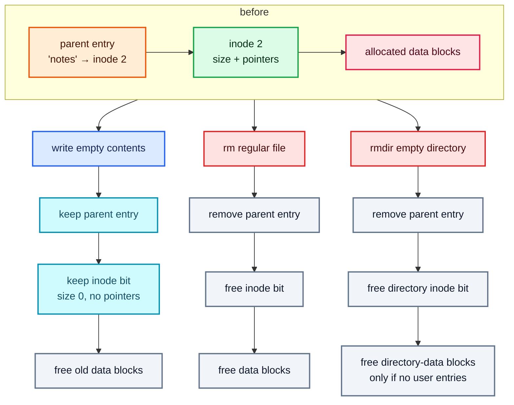
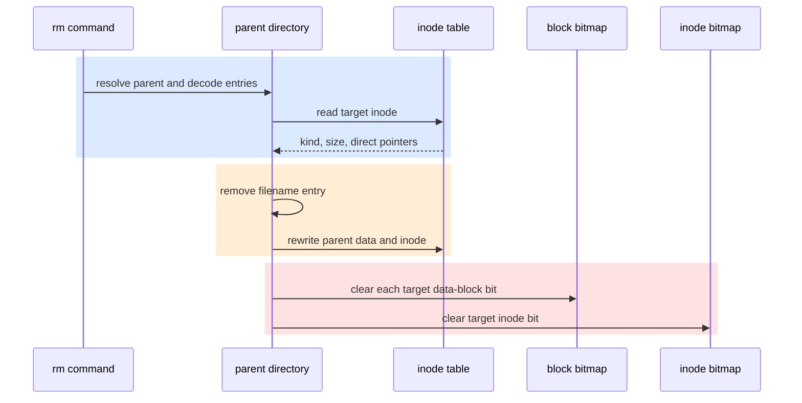
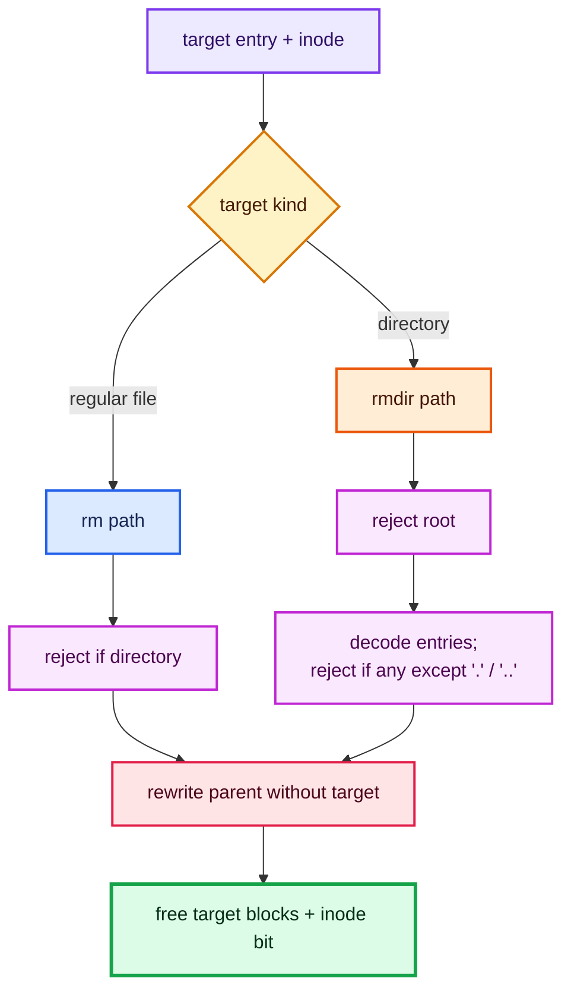
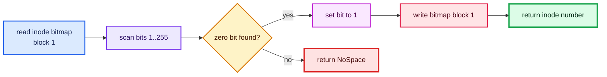
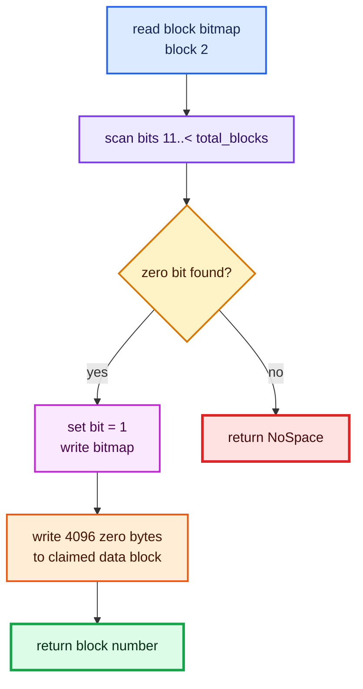
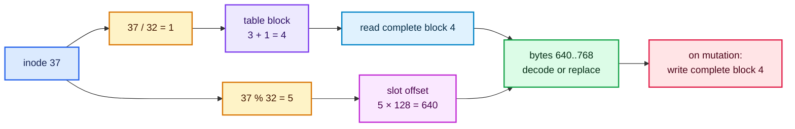
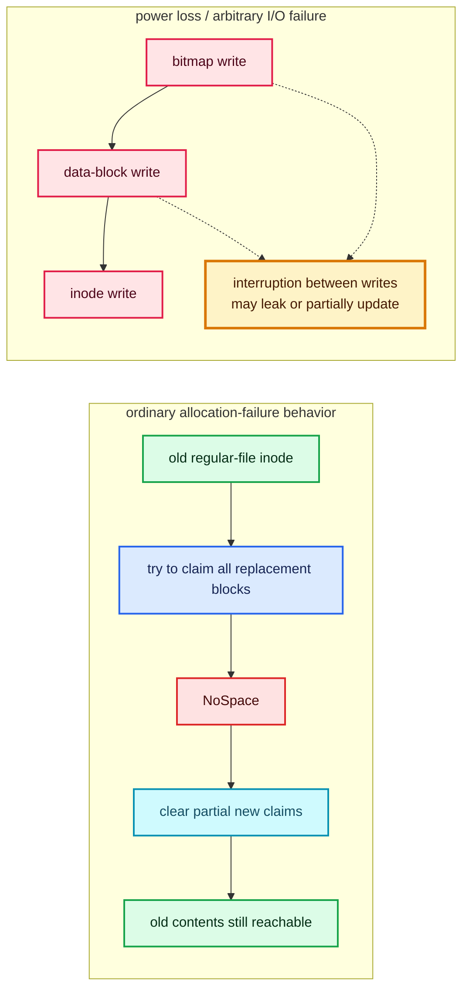
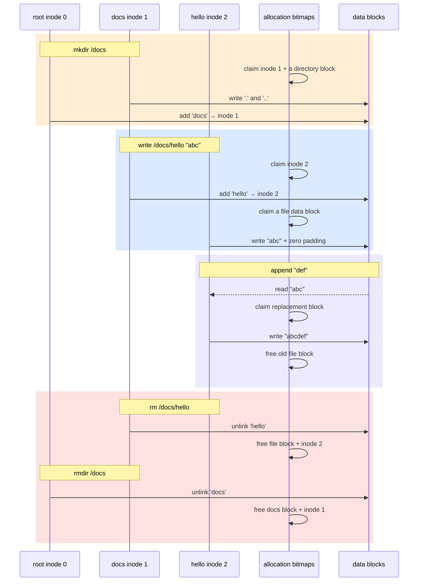

# Tutorial 4: deletion, allocation, and failure safety

This tutorial follows `rm`, compares it with `rmdir` and clearing contents, and
then traces the shared inode/block allocation machinery. It closes the loop
between user-visible operations and bitmap changes in the image.

## Three operations that sound like “delete”

They change different pieces of state:



| Operation | Parent name | Inode allocation bit | Data-block bits |
| --- | --- | --- | --- |
| `write FILE ""` | kept | kept | old blocks cleared |
| `rm FILE` | removed | cleared | cleared |
| `rmdir DIR` | removed, only if empty | cleared | directory-data blocks cleared |

## Delete a regular file (`rm`)

Try:

```console
cargo run -- disk.img rm /notes.txt
```

The CLI dispatch is deliberately thin:

Source: [`src/main.rs` — `rm` dispatch](../../src/main.rs#L195-L198)

```rust
let path = exactly_one(args, "rm <file>")?;
fs.remove_file(*cwd, path)?;
```

The library resolves the parent rather than the target path because it needs to
edit the parent’s entry list:

Source: [`src/filesystem/file.rs` — `remove_file`](../../src/filesystem/file.rs#L48-L69)

```rust
let (parent_number, name) = self.resolve_parent(cwd, path)?;
let mut parent = self.read_inode(parent_number)?;
let mut entries = self.read_directory(&parent)?;
let index = entries
    .iter()
    .position(|entry| entry.name == name)
    .ok_or_else(|| FsError::NotFound(path.into()))?;
let target_number = entries[index].inode;
let target = self.read_inode(target_number)?;
if target.kind == FileKind::Directory {
    return Err(FsError::IsDirectory(path.into()));
}

// Remove the name before returning its storage to the free pools.
entries.remove(index);
self.write_directory(parent_number, &mut parent, &entries)?;
self.free_inode_contents(&target)?;
self.set_inode_allocated(target_number, false)?;
```

### Exact deletion sequence



The order encodes an invariant: unlink the name first; free the target only
after it is unreachable. If storage were freed first, another operation could
reuse the inode or blocks while the old parent entry still named them.

Directory data is rewritten with retained blocks where possible. This lets
`rm` shrink a parent directory even when the image has no free data blocks:

Source: [`src/filesystem/disk.rs` — reuse calculation](../../src/filesystem/disk.rs#L75-L103)

```rust
let needed = blocks_for(data.len());
let old_blocks = used_blocks(inode);
let retained = old_blocks.len().min(needed);
let mut blocks = old_blocks[..retained].to_vec();

// Only directory growth needs additional blocks.
for _ in retained..needed {
    match self.allocate_block() {
        Ok(block) => {
            blocks.push(block);
            newly_allocated.push(block);
        }
        // ...
    }
}
```

Deletion does not overwrite the target’s former data blocks. It clears their
allocation bits. A later allocation clears each block before assigning it to a
new owner, preventing stale bytes from becoming visible through a newly
created file.

## Remove a directory (`rmdir`) versus `rm`

The namespace/storage tail is the same, but validation differs:



See the exact `rmdir` checks in
[Tutorial 2](02-paths-and-directories.md#remove-an-empty-directory-rmdir).
Rustyfile has no recursive delete: a learner can see each unlink and free
operation independently.

## Allocate an inode

Files and directories share one pool of 256 inode slots. Bit 0 belongs to root,
so allocation scans from 1:

Source: [`src/filesystem/disk.rs` — `allocate_inode`](../../src/filesystem/disk.rs#L133-L144)

```rust
let mut bitmap = self.read_block(INODE_BITMAP_BLOCK)?;
for inode in 1..INODE_COUNT {
    if !get_bit(&bitmap, inode) {
        set_bit(&mut bitmap, inode, true);
        self.write_block(INODE_BITMAP_BLOCK, &bitmap)?;
        return Ok(inode);
    }
}
Err(FsError::NoSpace)
```



`set_inode_allocated(inode, false)` performs the reverse during deletion:
read block 1, clear one bit, and write block 1.

## Allocate a data block

Block allocation scans the block bitmap from `DATA_BLOCK_START` (11), never
considering metadata blocks:

Source: [`src/filesystem/disk.rs` — `allocate_block`](../../src/filesystem/disk.rs#L153-L166)

```rust
let mut bitmap = self.read_block(BLOCK_BITMAP_BLOCK)?;
for block in DATA_BLOCK_START..self.superblock.total_blocks {
    if !get_bit(&bitmap, block) {
        set_bit(&mut bitmap, block, true);
        self.write_block(BLOCK_BITMAP_BLOCK, &bitmap)?;
        // Clearing prevents a new file from seeing deleted bytes.
        self.write_block(block, &[0; BLOCK_SIZE])?;
        return Ok(block);
    }
}
Err(FsError::NoSpace)
```



Claiming the bit precedes clearing the block. The filesystem is single-process
and has no concurrency control; the ordering makes ownership explicit but is
not a substitute for journaling.

## Free data blocks

`free_inode_contents` enumerates every nonzero direct pointer and clears its
block bit:

Source: [`src/filesystem/disk.rs` — `free_inode_contents`](../../src/filesystem/disk.rs#L125-L131)

```rust
pub(super) fn free_inode_contents(&mut self, inode: &Inode) -> Result<()> {
    for block in used_blocks(inode) {
        self.set_block_allocated(block, false)?;
    }
    Ok(())
}
```

Source: [`src/filesystem/disk.rs` — `used_blocks`](../../src/filesystem/disk.rs#L236-L244)

```rust
inode
    .direct
    .iter()
    .copied()
    .filter(|block| *block != 0)
    .collect()
```

The inode’s `size` is not used to decide which blocks to free. Every nonzero
pointer is considered owned. This is useful cleanup behavior, though a separate
integrity checker would be needed to reconcile badly corrupted pointers and
bitmaps safely.

## How one inode maps to the inode table

Inodes are 128 bytes and 32 fit in a 4096-byte block. The table starts at block
3:

Source: [`src/filesystem/disk.rs` — `read_inode`](../../src/filesystem/disk.rs#L175-L185)

```rust
let block = INODE_TABLE_START + inode / INODES_PER_BLOCK;
let offset = inode as usize % INODES_PER_BLOCK as usize * INODE_SIZE;
let bytes = self.read_block(block)?;
let raw: [u8; INODE_SIZE] =
    bytes[offset..offset + INODE_SIZE].try_into().unwrap();
Inode::decode(&raw)
```

Writing performs a read-modify-write of the containing block so adjacent inode
slots are preserved:

Source: [`src/filesystem/disk.rs` — `write_inode`](../../src/filesystem/disk.rs#L187-L194)

```rust
let block = INODE_TABLE_START + inode_number / INODES_PER_BLOCK;
let offset = inode_number as usize % INODES_PER_BLOCK as usize * INODE_SIZE;
let mut bytes = self.read_block(block)?;
bytes[offset..offset + INODE_SIZE].copy_from_slice(&inode.encode());
self.write_block(block, &bytes)
```

For inode 37:

```text
table block = 3 + (37 / 32) = 4
byte offset = (37 % 32) × 128 = 640
host offset  = 4 × 4096 + 640 = 17024
```



## Failure behavior by operation

The code makes some local failure cases recoverable, but the filesystem is not
crash-safe:

| Operation | Protection in the implementation | Remaining limitation |
| --- | --- | --- |
| create file/directory | clears a reserved child inode (and any child blocks) if linking fails | no journal across multiple metadata writes |
| replace file contents | claims all new blocks before changing the inode; allocation failure clears partial claims | I/O failure or power loss can interrupt later writes |
| append | delegates to complete replacement, so allocation failure preserves old contents | reads and rewrites the whole file |
| rewrite directory | reuses existing blocks; newly allocated growth blocks are rolled back on allocation failure | retained blocks are written before inode commit |
| `rm` / `rmdir` | unlinks before freeing storage | interruption after unlink can leak storage |



## End-to-end worked trace

Starting from a newly formatted image:

```console
cargo run -- disk.img mkdir /docs
cargo run -- disk.img write /docs/hello "abc"
cargo run -- disk.img append /docs/hello "def"
cargo run -- disk.img rm /docs/hello
cargo run -- disk.img rmdir /docs
```



After the final command, the image is back to one allocated inode (root) and
the metadata plus root directory data blocks. The bytes in freed blocks are not
erased at deletion time, but any future allocator zeroes a block before handing
it to a new inode.

Return to the [complete operation index](../OPERATIONS.md), or consult the
[on-disk format reference](../FORMAT.md) for exact byte offsets.
